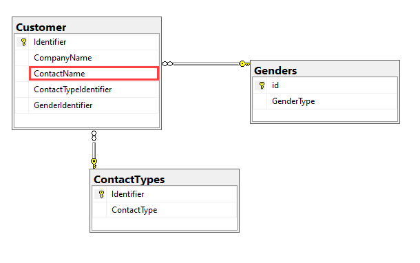

# About

We start with a almost good to go schema. The issue is `ContactName` which as coded has first and last name and perhaps middle name. To see this, run Scripts\Script_1.sql. 

Notes

- All data operations are in a class, Classes\DataOperations.cs
- 