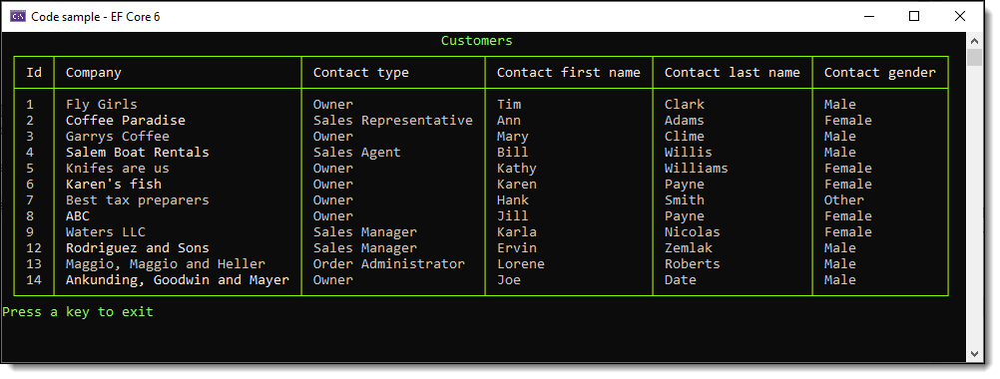

# About

In short the same code as in `CustomerDatabaseLibraryEntityFramework` (one method)

- Basic difference is C#10
- Why, to show you can start porting right away
    - Update NuGet package `Microsoft.EntityFrameworkCore.SqlServe` and you are good to go

