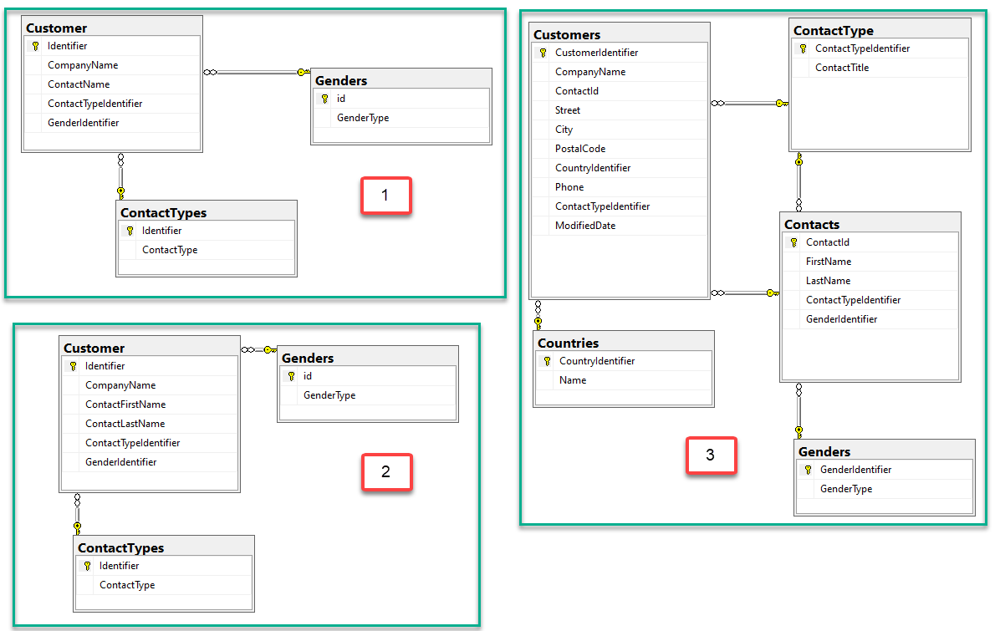
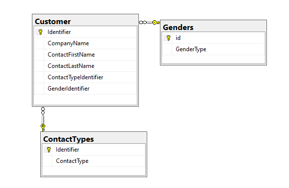

# Wrong/right design

:house:  [back home](readme.md)

First attempt for Customers as the main table with two child tables, one for contact type, one for gender.



```sql
SELECT C.Identifier, 
       C.CompanyName, 
       C.ContactName, 
       C.ContactTypeIdentifier, 
       C.GenderIdentifier, 
       CT.ContactType, 
       G.GenderType
FROM Customer AS C
     INNER JOIN ContactTypes AS CT ON C.ContactTypeIdentifier = CT.Identifier
     INNER JOIN Genders AS G ON C.GenderIdentifier = G.id;
```

Second attempt where contact name uses two columns. This version we can easily update first and/or last name while in the first attempt we must split first and last name and that can be a problem with two first names and/or two last names which is not uncommon.



```sql
SELECT C.Identifier, 
       C.CompanyName, 
       C.ContactFirstName, 
       C.ContactLastName, 
       C.ContactTypeIdentifier, 
       C.GenderIdentifier, 
       CT.ContactType, 
       G.GenderType
FROM Customer AS C
     INNER JOIN ContactTypes AS CT ON C.ContactTypeIdentifier = CT.Identifier
     INNER JOIN Genders AS G ON C.GenderIdentifier = G.id;
```

> **Note**:
> Both SQL statements use aliases for table names which is optional but so easy to do in SSMS (SQL-Server Management Studio) and is worth the effort when working with more complex SQL statements.

:house:  [back home](readme.md)


