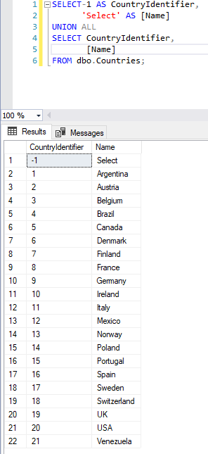
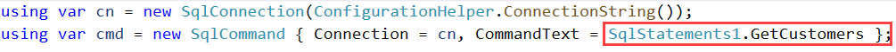
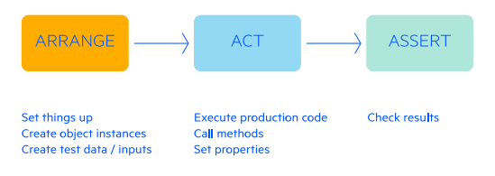
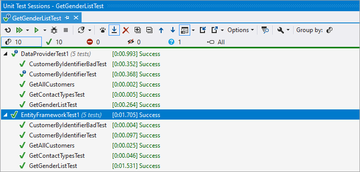

# New to working with databases lesson


> **Note**:
> I have written several articles and code samples for working with data in the past, in this article I have updated what has been presented in the past and added new things to learn.

When a person starts out working with databases they tend to not think through a good schema for storing data. 


For instance, to start learning the idea is to create a database which will store information for a company name, contact for the company, contact type (owner, sales agent etc), contact gender. See a bad desing and good design [here](dataModels.md).

The typical design will have all information in one table. The problem with this is simple, suppose for instance for contact type they use sales agent then down the road the decision is made to call sales agent sales person. This means each record needs to be updates manually while having a contact type table solves the problem by storing a key rather than a string value in the customer table, same with gender and as needed other types.

So with that rather than start coding, first figure out the database schema, create the database, populate with data and run queries to ensure proper output. If something does not work as expected than alter the schema until the proper output is achieved. 

Once the above has been done, consider the best option for interacting with data in code.

The number one mistake is using [TableAdapter](https://docs.microsoft.com/en-us/visualstudio/data-tools/fill-datasets-by-using-tableadapters?view=vs-2022&tabs=csharp) to working with data. It looks appealing and at first glance appears easy but only works with Windows Forms, will not work in [WPF](https://docs.microsoft.com/en-us/visualstudio/designers/getting-started-with-wpf?view=vs-2022), [MAUI](https://dotnet.microsoft.com/en-us/apps/maui) or web projects.

Next option is considered is [DataAdapter](https://docs.microsoft.com/en-us/dotnet/api/system.data.common.dataadapter?view=net-6.0), one step below TableAdapter. As with TableAdapter a DataAdapter does not fit well in with WPF, MAUI and web projects although one can force them into these types of projects.

Next option, is to create connection and command objects which allows a person fully control over interacting with data but requires the person to take time to embrace this method of working with data.

Best option is using [Entity Framework Core](https://docs.microsoft.com/en-us/ef/core/) were for a beginner they create the database as mentioned above followed by reverse engineering the database which generates code to work with the database. There are countless benefits for using Entity Framework. In the code samples provides we will keep to the basics.

# (DBLC) Database Life Cycle

The database life cycle (DBLC) defines the stages involved for implementing a database, starting with requirements analysis and ending with monitoring and modification. Furthermore, the DBLC never ends because database monitoring, modification, and maintenance are part of the life cycle, and these activities continue long after a database has been implemented. Put simply, the DBLC encompasses the lifetime of the database. The five stages in the database life cycle are:

1. `Requirements analysis`, depending on your environment may include DBA team, business parterners, other developers.
2. `Logical design` A logical data model establishes the structure of data elements and the relationships among them. It is independent of the physical database that details how the data will be implemented. The logical data model serves as a blueprint for used data.
3. `Physical design` The physical data model pertains to how the system will be implemented, and factors in the specific databases management system. This model is typically created by developers. The idea is more to define how the actual database will be used or implemented for business purposes.
4. `Implementation`, first in a development environment followed by test/QA environment then production.
5. `Monitoring, modification, and maintenance`

# Creating SQL statements

Once the model is ready, use SSMS (SQL-Server Management Studio) to create tables and relationships rather than write SQL statements directly in code and where there are WHERE conditions use parameters as this will be what is needed in code. 

First write the statement using the query designer, example

```sql
SELECT        Customers.CustomerIdentifier, Customers.CompanyName, Customers.ContactTypeIdentifier, Customers.ModifiedDate, Genders.GenderType, Contacts.FirstName, Contacts.LastName, ContactType.ContactTitle, Countries.Name, 
                         Customers.CountryIdentifier, Customers.ContactId
FROM            Customers INNER JOIN
                         Contacts ON Customers.ContactId = Contacts.ContactId INNER JOIN
                         ContactType ON Customers.ContactTypeIdentifier = ContactType.ContactTypeIdentifier AND Contacts.ContactTypeIdentifier = ContactType.ContactTypeIdentifier INNER JOIN
                         Genders ON Contacts.GenderIdentifier = Genders.GenderIdentifier INNER JOIN
                         Countries ON Customers.CountryIdentifier = Countries.CountryIdentifier
```

Not very readable so let's format the statement and use table [alasing](https://en.wikipedia.org/wiki/Alias_(SQL)).

```sql
SELECT Cust.CustomerIdentifier, 
       Cust.CompanyName, 
       Cust.ContactTypeIdentifier, 
       Cust.ModifiedDate, 
       G.GenderType, 
       C.FirstName, 
       C.LastName, 
       CT.ContactTitle, 
       Countries.Name, 
       Cust.CountryIdentifier, 
       Cust.ContactId
FROM Customers AS Cust
     INNER JOIN Contacts AS C ON Cust.ContactId = C.ContactId
     INNER JOIN ContactType AS CT ON Cust.ContactTypeIdentifier = CT.ContactTypeIdentifier
                                     AND C.ContactTypeIdentifier = CT.ContactTypeIdentifier
     INNER JOIN Genders AS G ON C.GenderIdentifier = G.GenderIdentifier
     INNER JOIN Countries ON Cust.CountryIdentifier = Countries.CountryIdentifier;
```

Now start writing various statements to ensure the design is sound and works before placing statements into code. For instance a simple example to get a single customer record.

```sql
DECLARE @CustomerIdentifier int = 7

SELECT Cust.CustomerIdentifier, 
       Cust.CompanyName, 
       Cust.ContactTypeIdentifier, 
       Cust.ModifiedDate, 
       G.GenderType, 
       C.FirstName, 
       C.LastName, 
       CT.ContactTitle, 
       Countries.Name, 
       Cust.CountryIdentifier, 
       Cust.ContactId
FROM Customers AS Cust
     INNER JOIN Contacts AS C ON Cust.ContactId = C.ContactId
     INNER JOIN ContactType AS CT ON Cust.ContactTypeIdentifier = CT.ContactTypeIdentifier
                                     AND C.ContactTypeIdentifier = CT.ContactTypeIdentifier
     INNER JOIN Genders AS G ON C.GenderIdentifier = G.GenderIdentifier
     INNER JOIN Countries ON Cust.CountryIdentifier = Countries.CountryIdentifier
WHERE 
	Cust.CustomerIdentifier = @CustomerIdentifier
```

Do the following for all statements to ensure they work properly.

On the same topic, when working with reference tables that will be displayed in the user interface such as, in this case a gender table and want the first option to be `Select` rather than add in code, do so in your SQL e.g.

```sql
SELECT-1 AS GenderIdentifier, 
      'Select' AS GenderType
UNION ALL
SELECT GenderIdentifier, 
       GenderType
FROM dbo.Genders;

```

Same for other tables e.g. Countries

```sql
SELECT-1 AS CountryIdentifier, 
      'Select' AS [Name]
UNION ALL
SELECT CountryIdentifier, 
       [Name]
FROM dbo.Countries;
```
</br>




# Code presented

There is code in the first iteration that is not used but will be used in future iterations, example, the project EntityCoreExtension has code not yet used.

# Connection strings

Most developers and novice coders will create a variable which defines a database connection string directly in code. This is fine when creating a personal project but for applications in a company environment the better option is to use a file to store the connection string.  

Next level is to store connection strings for development, testing/staging and production. Simple reasons, never use one database for coding and testing and production, bad things happen.

Sample file for connection strings, appsettings.json which resides in the root folder of a project with copy to output direction `Copy if newer`

```json
{
  "ConnectionsConfiguration": {
    "ActiveEnvironment": "Development",
    "Development": "Data Source=.\\SQLEXPRESS;Initial Catalog=CustomerDatabase;Integrated Security=True",
    "Stage": "Stage connection string goes here",
    "Production": "Prod connection string goes here"
  }
}
```

Set `ActiveEnvironment` to one of the three environments and run.

In the code samples presented in this repository I use a NuGet package [ConfigurationLibrary](https://www.nuget.org/packages/ConfigurationLibrary/) with [full source](https://github.com/karenpayneoregon/configurations-package/tree/master/ConfigurationLibrary).

Using a `data provider` usage

```csharp
using var cn = new SqlConnection(ConfigurationHelper.ConnectionString());
```

Using `EF Core`

```csharp
optionsBuilder.UseSqlServer(ConfigurationHelper.ConnectionString());
```

Above uses SQL-Server but will work with any database with a proper connection string in `appsettings.json`


# Attempt 1

We will work with data using a connection and command object. Data operations are in CustomerDatabaseLibrary and to run code this is done in DataUnitTestProject\Test1.cs

- Testing is done using [NFluent](https://www.nuget.org/packages/NFluent/2.8.0) NuGet package.
- In later attempts, Test1.cs will fail as the database schema will change

## SQL

For Contact type and gender tables we want two options. The first to return all rows and the second to return all rows with the first row as `Select` which is for forcing a user to make a selection. When validating with `Select`, we can check if the key is -1 and if so no selection was made.

Example for Gender

Get rows

```sql
SELECT id, GenderType FROM dbo.Genders;
```

Get rows and insert `Select`

```sql
SELECT -1 AS Id, 'Select' AS GenderType UNION ALL SELECT Id, GenderType FROM dbo.Genders;
```

Some might use the first query and in code place a Gender instance as the first item. Sure this works but whenever we can do work at the database level do so.

```csharp
List<Genders> list = new() { new Genders() {id = -1, GenderType = "Select"}};
```

### Date types

Make sure to learn how to work with date type, for example how to find, in this case records where the column type has both date and time and we don't want to use time.

```sql
DECLARE @ModifiedDate date = '2020-04-24'

SELECT Cust.CustomerIdentifier, 
       Cust.CompanyName, 
       Cust.ContactTypeIdentifier, 
       Cust.ModifiedDate, 
       G.GenderType, 
       C.FirstName, 
       C.LastName, 
       CT.ContactTitle, 
       Countries.Name, 
       Cust.CountryIdentifier, 
       Cust.ContactId
FROM Customers AS Cust
     INNER JOIN Contacts AS C ON Cust.ContactId = C.ContactId
     INNER JOIN ContactType AS CT ON Cust.ContactTypeIdentifier = CT.ContactTypeIdentifier
                                     AND C.ContactTypeIdentifier = CT.ContactTypeIdentifier
     INNER JOIN Genders AS G ON C.GenderIdentifier = G.GenderIdentifier
     INNER JOIN Countries ON Cust.CountryIdentifier = Countries.CountryIdentifier
WHERE CAST(ModifiedDate AS DATE) = @ModifiedDate
```

### Clean statements

Rather than place SQL statements in code, in these examples statements are in a class e.g.

```csharp
namespace CustomerDatabaseLibrary.Classes
{
    public class SqlStatements1
    {
        public static string GetGenders => 
            "SELECT id, GenderType FROM dbo.Genders;";

        public static string GetGendersWithSelect => 
            "SELECT -1 AS Id, 'Select' AS GenderType UNION ALL SELECT Id, GenderType FROM dbo.Genders;";

        public static string GetContactTypes => 
            "SELECT Identifier, ContactType FROM dbo.ContactTypes;";

        public static string GetContactTypesWithSelect => 
            "SELECT -1 AS Identifier, 'Select' AS ContactType UNION ALL SELECT Identifier, ContactType FROM dbo.ContactTypes;";

        public static string GetCustomers => 
            @"SELECT C.Identifier, C.CompanyName, C.ContactName, G.GenderType, CT.ContactType, C.ContactTypeIdentifier, C.GenderIdentifier
              FROM   Customer AS C INNER JOIN  Genders AS G ON C.GenderIdentifier = G.id INNER JOIN ContactTypes AS CT ON C.ContactTypeIdentifier = CT.Identifier";
    }
}
```

Then in code



This is optional but worth consideration


## Return List

In the code presented we use [IReadOnlyList](https://docs.microsoft.com/en-us/dotnet/api/system.collections.generic.ireadonlylist-1?view=net-6.0) so that the consumer can not add other options. You can if so desired return a List instead but why? If there is a reason to add more items do it in the method instead or rethink your logic.

```csharp
public static IReadOnlyList<Genders> GendersList()
{
    List<Genders> list = new(); 

    using var cn = new SqlConnection(ConfigurationHelper.ConnectionString());
    using var cmd = new SqlCommand { Connection = cn, CommandText = SqlStatements.GetGendersWithSelect };

    cn.Open();

    var reader = cmd.ExecuteReader();

    while (reader.Read())
    {
        list.Add(new Genders() 
            {id = reader.GetInt32(0), GenderType = reader.GetString(1) });
    }

    return list.ToImmutableList();
}
```

# Comparing data provider to EF Core

See [the following](ComparingMethods.md) for code samples

- All work is done in unit test projects
- For round 1 (these will fail in round 2)
  - DataProviderTest1.cs
 
> **Note**:
> In round 2 data provider and entity framework core test will be in separate unit test projects.

## Points of interest

- For data provider and EF Core both have the same models while in the EF Core models they have [navigation properties](https://docs.microsoft.com/en-us/ef/core/modeling/relationships?tabs=fluent-api%2Cfluent-api-simple-key%2Csimple-key) while data provider does not. Having navigation properties is a bonus as we can navigate collections and also never (in these examples) have to be concerned with inner joins.
- With data providers if a property name changes for a underlying column you are responsible for finding and replacing them in code while with EF Core simply repeat reverse engineering process.
  - If there is code you don't to have overwritten with EF Core, that is where [partial classes](https://docs.microsoft.com/en-us/dotnet/csharp/programming-guide/classes-and-structs/partial-classes-and-methods) works. You can place customer code into a parial class and now will not be lost with a repeating reverse engineering process.
- A nice Visual Studio extension for reverse engineering an existing database is [EF Power Tools](https://marketplace.visualstudio.com/items?itemName=ErikEJ.EFCorePowerTools), right click on a project, select the EF Power Tools option then `Reverse Engineer`.

## Unit test

<!--- image from Progress unit test PDF --->


All operations are performed in unit test to isolate from any frontend project for learning without having to understand a specfic user interface. 

- [Bogus](https://www.nuget.org/packages/Bogus) NuGet package is used to mock up data for adding new records. See BogusOperations.cs under Classes folder
- [NFluent](https://www.nuget.org/packages/NFluent/2.8.0) and [FluentAssertions](https://www.nuget.org/packages/FluentAssertions) are used for assertions
- For any verification against database tables see VerificationOperations.cs under Classes folder

# Data provider SQL statement peeker


# Documentation vs Stackoverflow


Many coders/developers when stuck will instantly go to Stackoverflow for help. My recommendation is to first read Microsoft documentation rather than use Stackoverflow.

Sure Stackoverflow is an excellent resource for assistance but one must first do research (which means read the documentation and make an effort with code) which in many cases will help resolve the issue or allow you to write a better question on Stackoverflow.

- .NET Data documentation [](https://docs.microsoft.com/en-us/ef/dotnet-data/)
- .NET Framework Data Providers [](https://docs.microsoft.com/en-us/dotnet/framework/data/adonet/data-providers)


## Recommendation

Rather than using Visual Studio's unit test functionality consider JetBrains [test harness](https://www.jetbrains.com/resharper/features/unit_testing.html)



# References

- .NET Data documentation [](https://docs.microsoft.com/en-us/ef/dotnet-data/)
- What is a Logical Data Model? [](https://www.tibco.com/reference-center/what-is-a-logical-data-model)
- Writing SQL for your application [](https://github.com/karenpayneoregon/writing-sql-queries-csharp)
- Considerations for modeling a database with EF Core [](https://github.com/karenpayneoregon/data-design-consider-ef-core)
- SQL stored procedures primer [](https://github.com/karenpayneoregon/StoredProcedureBasicsWindowsFormsCS)
- Defensive programming SQL-Server contraint violations [](https://social.technet.microsoft.com/wiki/contents/articles/51497.net-defensive-data-programming-part-2.aspx)
- Dynamic WHERE IN [](https://github.com/karenpayneoregon/dyynamic-sql-where-in)
- Moving from .NET Framework to .NET Core with SQL-Server [](https://github.com/karenpayneoregon/SqlServerFindDuplicateRecords)
- SQL-Server- C# Find duplicate record with identity [](https://github.com/karenpayneoregon/moving-to-net5-version1)
- SQL-Server freezes when connecting [](https://github.com/karenpayneoregon/sqlserver-connection-timeout)
- EF Core in memory testing 1 [](https://github.com/karenpayneoregon/ef-core-5-in-memory)
- EF Core in memory testing 2 [](https://github.com/karenpayneoregon/EntityFrameworkCoreInMemoryTesting)


# Social

[](https://stackoverflow.com/users/5509738/karen-payne) [](http://www.twitter.com/KarenPayneMVP) 